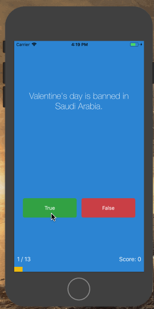
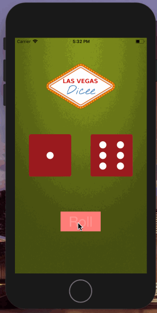

# iOS-Binge-Projects
Learning iOS dev by completing 10+ mini-apps in a short period of time.

<!-- TOC depthFrom:1 depthTo:6 withLinks:1 updateOnSave:1 orderedList:0 -->

- [iOS-Binge-Projects](#ios-binge-projects)
	- [tipCalc2](#tipcalc2)
	- [Quizlet](#quizlet)
	- [Dice Generator](#dice-generator)
	- [ReadMe boilerplate](#readme-boilerplate)
	- [License](#license)

<!-- /TOC -->
- - - -

## tipCalc2
*Features:* Interactive label.

*Takeaways:* Using code to change variables. Arrays implementation.

*Hurdles:* Had a bug. Redid the project and it worked.

>> [Check out Project](/tipCalc2)

## Quizlet
*Features:* Progress Bar. Track Score. End Modal.

*Takeaways:* Used MVC design. Created classes. Formed Question Bank

*Hurdles:* Placeholder- the blue TAG

> 
>> [Check out Project](/Quizlet)

## Dice Generator
*Features*
- Generates two random die when shaking the phone
> 
>> [Check out Project](/Dicee)

## ReadMe boilerplate
*Features:*

*Takeaways:*

*Hurdles:*

> 
>> [Goto Project](/)

## License
© 2018 Yasin Ehsan

Licensed under the [Apache License](LICENSE).
