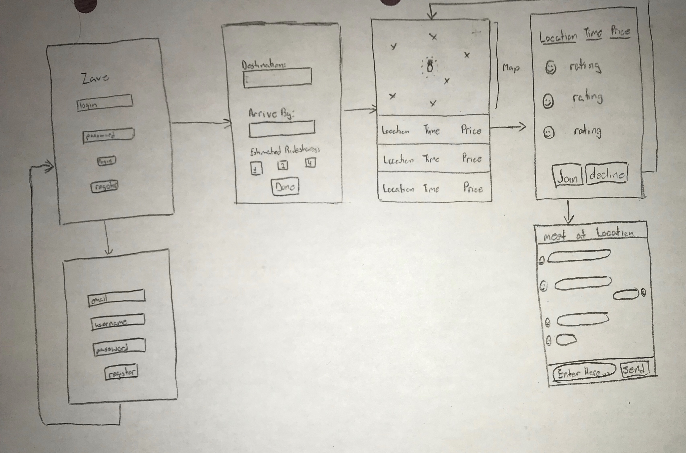

# storyboard-streaks
Mastering iOS development by completing 30+ apps in a short period of time.

### Contents
- [Problem-Driven Projects](#Problem-Driven-Projects)
- [Feature-Driven Projects](#Feature-Driven-Projects)

- [Debug](#Debug)
- [Git](#Git)


# Problem-Driven Projects
## Zave
- **Problem** We frequently crave a premium travel experience offered by ride-sharing apps but we are going broke.

- **Solution** Zave connects ride-share users to split Uber/Lyft at metro price by connecting local ride-shares with shared destinations.

- **Iteration** Create an algorithm that finds the the midpoint meetup place between shared commuters. This way no rider feels like they are doing more "work" than the others.

Overall 2nd place from 40+ teams part of the 12-week iOS bootcamp trained by lead teams in San Francisco. [CodePath](https://codepath.org/)

<!--  -->

<!--  -->

<!--  -->

More on Zave
- [Pitch Deck](assets/zave-ppt)
- [My Presentation (YouTube)](https://www.youtube.com/watch?v=6r5Ytpu9XV8)
- [Visit Project Repo](https://github.com/ZaveApp/product)


# Feature-Driven Projects
## Add Table View Row
- **Feature** add a custom table view row from a different segue

- **Stack** xcode 10.2 swift 5

- **Takeaway**
    - uibutton > attributes inspctor > system item > deault buttons

### send data from add table VC
```Swift
// this action is linked to a button on diff VC
// click on the button + cntrol and fimd the 3rd thing next to yellow moon AKA EXIT


@IBAction func done(segue:UIStoryboardSegue) {
let carDetailVC = segue.source as! CarDetailViewController
newCar = carDetailVC.carTestField.text ?? "lmfr"

cars.append(newCar)
carTableView.reloadData()
}

```


<!--[Visit Project](https://github.com/YasinEhsan/TableViewAddRow) -->


## Quick Chat
- **Feature** Real-time messaging app.

- **Stack** Swift 4.2 and Google Firebase Auth.

- **Takeaway** Chat logs can be stored w/o creating a real-time database.


[Visit Project](https://github.com/YasinEhsan/quick-chat)


# Debug
- error: SWIFT_VERSION '5.0' is unsupported, supported versions are: 3.0, 4.0, 4.2._  
    - Fix : .xcw workspace > blue pod/proj file > build settings > swift lang > change to 4.2 or desirable
- error: Multiple commands produce_
    - Fix : Open target > Build phases > Copy Bundle Resources and remove info.plist from there.


# Git
## Branch + Merge
- **Create Branch:** "git checkout ____" creates subbranch from current head
- I am calling the sub-branch's origin branch parent. It could be called master, feature/..., releases, etc
- Parent branches shouldn't be tweaked while work is being done in subbranch
- **Merge Branch:** "git checkout" to parent branch. And then "git Merge" with the branch you currently working on. This merges the working branch with the parent branch. Afterwards checkout to working branch and merge with parent. The order is important.
- In the network graphics, working branches should be ahead of main branch before any merging. After merging, all tags should align with parent branch being a straight line all along branching process.
- In between each stage of merge/checkouts make sure to git pull.
- Also, do the merges from child's editor's computer for iOS projects. This gives us an option to 86 that branch without having to redo the project if there are any serious .plist / pod / XML merge conflicts.


## Local to Global first-time setup
- git config --list (checks current git account)
- git config -- global user.name " "
- git config -- global user.email " "
- some others pre-reqs: SSH for alternate to https and GPG keys for verified git commits
- git init
- echo "#repo-name" > README.md
- git commit -am" "
- create the git repo online WITHOUT a README. Then copy the code from the section that reads: **"...or push an existing repository from the command line"**
- git push (-u origin master)


# License
© 2018 Yasin Ehsan
Licensed under the [Apache License](LICENSE).
