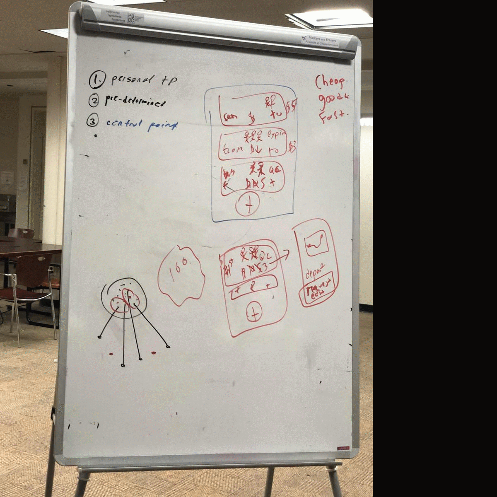
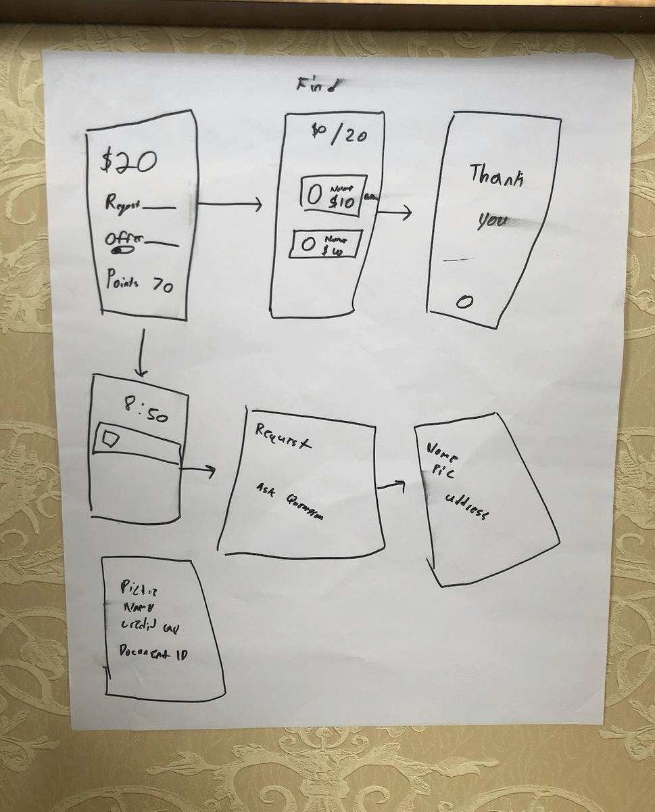
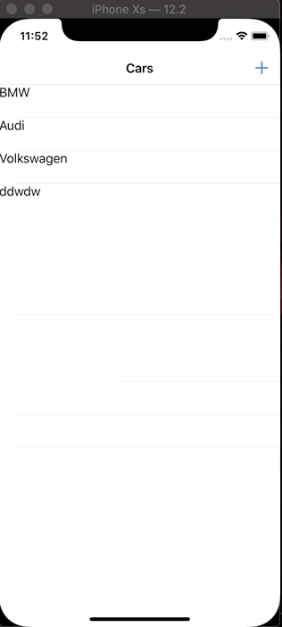

# storyboard-streaks
Mastering iOS development by completing 30+ apps in a short period of time.

### Contents
- [Problem-Driven Projects](#Problem-Driven-Projects)
- [Feature-Driven Projects](#Feature-Driven-Projects)

- [Debug](#Debug)
- [Git](#Git)


# Problem-Driven Projects
## Split Uber

Overall 2nd place from 40+ teams part of the 12-week iOS bootcamp trained by lead teams in San Francisco. Built using Swift, Google Cloud, and Zeplin design. <br/> <br/>

- **Problem** We frequently crave a premium travel experience offered by ride-sharing apps but we are going broke.

- **Solution** Zave connects ride-share users to split Uber/Lyft at metro price by connecting local ride-shares with shared destinations.

- **Iteration** Create an algorithm that finds the the midpoint meetup place between shared commuters. This way no rider feels like they are doing more "work" than the others.

 <br/>

*Plan -> Prod*
<div style="display: inline-block;">
  
  <!--  -->
  
</div><br/>

More on Zave
- [My Presentation (YouTube)](https://www.youtube.com/watch?v=6r5Ytpu9XV8)
- [Pitch Deck](assets/zave-ppt)
- [Visit Project Repo](https://github.com/ZaveApp/product)
- [CodePath Bootcamp](https://codepath.org/)

<br/>

## Find Cash
Overall top 10 from 550+ Capital One Software Engineering Interns competing in a hackathon during onboarding week. Built using Swift and Python(Flask), SQLite and Zeplin design.<br/> <br/>

- **Problem** In a world of scale and a battle of margins, small cash businesses are taking the biggest hits with credit card minimums or ATM fees for customer withdrawals.

- **Solution** Alamo connects to trade cash(providers) for Venmo(requesters) w/o any fees.

- **Iteration** Increase reliability that both parties deliver by building a credit-score-like system.

<br/>

*Plan -> Prod*
<div style="display: inline-block;">
  
  <!--  -->
  
</div><br/>

More on Alamo
- [Pitch Deck](assets/alamo-ppt)
- Project repo n/a (corporate Github)

<br/>

## Final Message
Demo-ed our app and presented to Facebook, Google, IBM, NYU judges and competed with 100+ team submissions. STACK: Swift, Google Cloud, Watson AI, Figma design.<br/> <br/>

- **Problem** People want to leave a positive mark before they rest forever.

- **Solution** A platform where people at risk-of-death can document and share their life stories to encourage, inspire, and uplift viewers.

- **Iteration** Able to crowdsource money to rescue civilians and refugees in war zones.

<br/>

*Plan -> Prod*
<div style="display: inline-block;">
  
  <!--  -->
  
</div><br/>

More on Uplift
- [Visit Project Repo](https://github.com/matthewbrod01/Uplift)

<br/>

## Outfit Selector
Awarded private tour of Google HQ for best implementation of Google Cloud and most innovative/quirky hack from 40+ teams at Cooper Union hackathon. STACK: Swift, Google Firebase + AutoML, Sketch design. <br/><br/>

- **Problem** A good amount of time and stress happens over what to wear in the morning.

- **Solution** App that preselect wardrobe outfits based on the weather days in advance.

- **Iteration** Superimpose outfit on a photo of the user to get a mirror-like experience.

<div style="display: inline-block;">
  
  <!--  -->
  <!--  -->
</div><br/>

More on Forcast Fit
- [Visit Project Repo](https://github.com/YasinEhsan/forcast-fit)

<br/>

## Carbon Footprint
- **Problem** Depleting Earth's non-renewable resources have a serious foreseeable cost.

- **Solution** Eternity displays user’s contribution in depleting Earth’s natural resources. Used Apple’s CoreML for grocery scan image recognition, Apple’s CoreLocation to calculate distance and speed of transportation and Google Firebase to store gas/electricity bills.


- **Iteration** Gamify carbon score with others in proximity.
<br/>

More on Eternity
- [App Demo](https://www.youtube.com/watch?v=MBVfbk3DaxU)
- [Visit Project Repo](https://github.com/YasinEhsan/eternity)

<br/>

## Rent Parking
- **Problem** A daily frustration of New York drivers is having difficulty finding parking spaces.

- **Solution** HomeDrive connects drivers in need of parking spaces to homeowners willing to rent out their garage/driveway.

- **Iteration** Geofence neighbor-net residences around firms to reserve parking for corporate employees.

<div style="display: inline-block;">
  
  <!--  -->
  <!--  -->
</div><br/>

More on HomeDrive
- [Visit Project Repo](https://github.com/YasinEhsan/HomeDrive)

<br/>




# Feature-Driven Projects

## summer-project-notes
- **Feature** geofencing, overlays, pin-drop, notifications, protocols, optionals, mapkit, corelocations,

- **Stack** swift 5, xcode 10.2

- **Takeaway**
    - blue dot aka real time location not showing. Didn't add my NSexceptions to plist.
    - MKCircle is used for overlay
    - a subclass cannot override instabce variables BUT it can override methods  <!-- line break -->
    - fileprivate/internal vs private. the latter is more restricted within a scope not file
    - whenever you create an optional varaible proprty "?" than you have to unwarp it using *if let* or *gaurd else*
    - ternary conditional operator **condition ? something : something else**
    - numArry.sort {$0 > $1} //sorts in decending order
    -  return multiple parameteres
    - *func nearestDealers(distances: [Int : CLLocation]) -> ( [CLLocation], Double)*
    - **CLLocation vs CLLocationCoordinate2D**
        - the former is a class, has varibles like the latter, has functions like .distance from, and can be init using lat long
        - the latter is a struct, has a few methods including CLLocationCoordinate2dMake
        - the former is smooves

**for each w index + String format**
```Swift
for (index, element) in list.enumerated() {
print("Item \(index): \(element)")
}

let str = NSString(format:"%d , %f, %ld, %@", INT_VALUE, FLOAT_VALUE, LONG_VALUE, STRING_VALUE)
```

**Exhaustive switch for enums**
```Swift
enum CompassPoint {
case north
case south
case east
case west
}

var directionToHead = CompassPoint.west

directionToHead = .south
switch directionToHead {
case .north:
print("Lots of planets have a north")
case .south:
print("Watch out for penguins")
case .east:
print("Where the sun rises")
case .west:
print("Where the skies are blue")
}
// Prints "Watch out for penguins"

```
**Init an enum custom class**
```Swift
enum Suit: String {
case hearts, spades, diamonds, clubs

static func allValues() -> [Suit]{
return [.clubs, .diamonds, .hearts, .spades]
}

//inside custom class/struct
let suit: Suit, value: Value

init(suit: Suit, value: Value) {
self.suit = suit
self.value = value
}

```
**Create Dummy model class extensions**
```Swift
//some dummy geofences
extension Geofence{
static let geo1 = Geofence(center: CLLocationCoordinate2DMake( 37.08302, 76.16999), radius: 10000, identifier: "geo1")

static let geo2 = Geofence(center: CLLocationCoordinate2DMake( -57.58808, 49.91300), radius: 10000, identifier: "geo2")

static let geo3 = Geofence(center: CLLocationCoordinate2DMake( -16.84364, -16.84364), radius: 10000, identifier: "geo3")

static let geo4  = Geofence(center: CLLocationCoordinate2DMake( -11.25000, -13.94586), radius: 10000, identifier: "geo4")
}

```

**Rounding double swift**
```Swift
    let num: Double = 4.5

    num.rounded() // returns 5. normal rounding
    num.rounded(.down)
    num.rounded(.up)

    num.rounded(.toNearestOrEven)
    num.rounded(.toNearestOrAwayFromZero)
    num.rounded(.towardZero)

    ceil(num) //round up
    floor(num)
    Int(num) //round down implicit
```

**Getter and setter for computed property**
```Swift
protocol FullyNamed {
var fullName: String { get }
}
struct Detective: FullyNamed {
fileprivate var name: String
var fullName: String {
get {
return name
}
set {
name = newValue
}
}
}
var Payne = Detective(name: "Payne")
print(Payne.fullName) // returns "Payne"
Payne.fullName = "Max Payne"
print(Payne.fullName) // returns "Max Payne"

```

**All the code for real time location**
```Swift
import UIKit
import MapKit
import CoreLocation

internal class GeoFencesViewController : UIViewController {

@IBOutlet weak internal var mapView: MKMapView!

internal let locationManager: CLLocationManager

override internal func viewDidLoad()

@IBAction internal func addRegionLongGesture(_ sender: Any)
}

extension GeoFencesViewController : CLLocationManagerDelegate {

internal func locationManager(_ manager: CLLocationManager, didUpdateLocations locations: [CLLocation])
}

```
<!-- [Visit Project]() -->


## Mapkit search, MKannotations
- **Feature** userlocation, maps, search api, present, connect other app

- **Stack** xcode 10.2, swift 5, apple map api

- **Takeaway**
- when copying delgate methods from tutorial, sometimes the code is legacy. just try running a simmialr medthod signiture

**Span wave effect user location**
```Swift

func locationManager(manager: CLLocationManager, didUpdateLocations locations: [CLLocation]) {
if let location = locations.first {
let span = MKCoordinateSpan(latitudeDelta: 0.05, longitudeDelta: 0.05)
let region = MKCoordinateRegion(center: location.coordinate, span: span)
myMapView.setRegion(region, animated: true)
}
}

```

**SEt up search bar w TVC**
```Swift

//global variable
var resultSearchController:UISearchController? = nil

override func videdidload {setupsearchbar()}

func setUpSearchBar(){
let locationSearchTable = storyboard!.instantiateViewController(withIdentifier: "LocationSearchTable") as! LocationSearchTable
resultSearchController = UISearchController(searchResultsController: locationSearchTable)
resultSearchController?.searchResultsUpdater = locationSearchTable as? UISearchResultsUpdating

let searchBar = resultSearchController!.searchBar
searchBar.sizeToFit()
searchBar.placeholder = "Search for places"
navigationItem.titleView = resultSearchController?.searchBar

resultSearchController?.hidesNavigationBarDuringPresentation = false
resultSearchController?.dimsBackgroundDuringPresentation = true
definesPresentationContext = true
}

//create a tvc class and view add this
extension LocationSearchTable : UISearchResultsUpdating {
func updateSearchResults(for searchController: UISearchController) {

}

```

**Search apple map API**
```Swift

extension LocationSearchTable : UISearchResultsUpdating {
func updateSearchResults(for searchController: UISearchController) {
guard let mapView = mapView,
let searchBarText = searchController.searchBar.text else { return }

let request = MKLocalSearch.Request() //enter search
request.naturalLanguageQuery = searchBarText
request.region = mapView.region

let search = MKLocalSearch(request: request) //APPLE API
search.start { response, _ in
guard let response = response else {
return
}
self.matchingItems = response.mapItems
self.tableView.reloadData()
}
}

```


<!-- [Visit Project]( -->

## user-location3
- **Feature** blue dot, oop

- **Stack** swift5, xcode10.2

- **Takeaway**
- *rename ib outlet* once ib outlet is connected, to rename var, first disconnect the ib outlet from the inspector, then rename the iboutlett in the class file, then reconnect via hover.
- *mapView.showsUserLocation = true* one liner for blue dot on simulator
- *LocationManager.startUpdatingLocation()* one linner for blue dot on phone
- a mapkit annotation is like the rain drop. looks dope on map.
- startUpdaint call to dlegate is the same as didUpdate? gotta find out

<!-- [Visit Project]() -->

## Geofencing2
- **Feature** corelocation geofencing

- **Stack** swift 5, xcode10.2

- **Takeaway**
    - theres a method for a change in location prefernces. sean allen -beard guy- does it really well
    - **<+37.62919127,-122.43325339>** a real-time coordinate is fiven by lat long with upto 8 places after deciaml
    - **locationManager.distanceFilter = 100** prevents constant update. save battery life

### code for current location
```Swift
//import corelocation have corelocation delegate subclass

let locationManager = CLLocationManager()//constructor

locationManager.delegate = self
locationManager.requestAlwaysAuthorization() //we can ask this later
locationManager.startUpdatingLocation()
locationManager.distanceFilter = 100 //updates location once that distance is reached saves batterty life

func locationManager(_ manager: CLLocationManager, didUpdateLocations locations: [CLLocation]) {
for currentLocation in locations{ //current coordinate in freeway drive
print("\(index): \(currentLocation)") // "0: [locations]
}
}

add mapkit for blue dot on map
```
### to create a geofence
```Swift
//we need the corelocation code from above

//creates geofence
let geoFenceRegion: CLCircularRegion = CLCircularRegion(center: CLLocationCoordinate2DMake(43.61871, -116.214607), radius: 100, identifier: "boise")

locationManager.startMonitoring(for: geoFenceRegion)

func locationManager(_ manager: CLLocationManager, didEnterRegion region: CLRegion) {
print("entrer")
}

func locationManager(_ manager: CLLocationManager, didExitRegion region: CLRegion) {
print("left")
}

//other possible features to add are overlays, notifications and alerts etc.
```
 <!-- [Visit Project]( -->
 **Done Prior**


## Geofencing1
- **Feature** real time location, geofencing, notifications

- **Stack** swift 5, xcode 10.2

- **Takeaway**
    - a shortcut to .plist search shown by location pop up. Instead of searching the .plist file, run the ap. in the debug console the app required key for the .plist file(which is a preety v of XML) will show. Cp and turn up.

<!-- [Visit Project]( -->

## user location
- **Feature** p1: user location and update

- **Stack** swift 5, 10.2 xcode

- **Takeaway**
    - Blue dot isnt showing even when  "mapView.showsUserLocation = true". This might be control flow, I feel its a one time xcode setting thing

## deck-of-cards
- **Features** auto-layout fundamentals, enums, oop, dictionary, tags, protocols

- **Stack** swift 3 boiler --> swift 4 (build settings)

- **Takeaways**
  - cp ~/desktop/test.java ~/documnets copies java file
  - Enum.possibity.**raw value** gives the value of = type
  - convrted Enum.(class varaible).rawValue using switch statement variable flow.
  - didSelect() is next steps for selected tableRow
  - METHOD 1: call performSegue() and define prepare(for segue...) later. Segues have to be created first.
  - METHOD 2: name identifiers for storyboard, vc this is prolly the move for large projects. call proceed() and dismiss()
  - to copy vc find the title on the left list and then cmd + c
  - UI: Storyboards > Scenes > VC
  - swift protocols are like interfaces in Java

 ```swift
 override func prepare(for segue: UIStoryboardSegue, sender: Any?) {
 print("begin")
 //TODO: pass the sender to the destination view controller
 if segue.identifier == "showDetailCardJQKSegueID" {
 let vc = segue.destination as! DetailCardJQKViewController
 vc.cardRef = sender as! Card
 print("case 1")
 }
 else if  segue.identifier == "showDetailCard8SegueID" {
 let vc = segue.destination as! DetailCard8ViewController
 vc.cardRef = sender as! Card
 print("dhhu")
 }

 }

 ```


<!-- [Visit Project (my project repo in private)]( -->

## image-view-custom
- **Feature** switch images on same Imageview using dictionaries

- **Stack** swift 5. xcode 10.2

- **Takeaway** there is a way of accesing an IB colelction w/o literally looking it up in the order it was put in. At first I thought of a for loop to search for the tags in the entire collection but creating a dictionary from tag to image is most effieciant. I don't wanna spell.


<!-- [Visit Project] -->

## tip calculator 2.0
- **Feature** use enums, classes and oop fundamentals

- **Stack** xcode 10.14 swift 4

- **Takeaway** oop done right saves a lot of code


<!-- [repo link] -->

## Tip Calculator
- **Feature** Swift Classes. UIKIT. Great design w no assets.

- **Stack** Xcode 10.2. Swift 5.

- **Takeaway** Stronger Fundamentals of Swift classes.


 <!-- [Visit Project] -->

# Boilerplate
## Table Views
**Need**
    1. View controller file with extensions of delegate and datasource
    2. custom cell file
    3. custom object file

**VC**
```Swift
//VIEW CONTROLLLER CLASS
@IBOutlet weak var tableView: UITableView!
var videos : [Video] = []

override func viewDidLoad() {
super.viewDidLoad()
videos = createArray()
tableView.delegate = self
tableView.dataSource = self
}

func createArray() -> [Video]{
var temp: [Video] = []
temp.append(Video(title: "First car", image: UIImage(named: "audi.jpg") ?? UIImage()))
temp.append(Video(title: "second car", image: UIImage(named: "audi.jpg") ?? UIImage()))
temp.append(Video(title: "third car", image: UIImage(named: "audi.jpg") ?? UIImage()))
return temp
}

extension VideoViewController: UITableViewDelegate, UITableViewDataSource {
func tableView(_ tableView: UITableView, numberOfRowsInSection section: Int) -> Int {
return videos.count
}

func tableView(_ tableView: UITableView, cellForRowAt indexPath: IndexPath) -> UITableViewCell {
let video = videos[indexPath.row]

let cell = tableView.dequeueReusableCell(withIdentifier: "VideoCell") as! VideoTableViewCell

cell.setVideo(video: video)

return cell
}

func numberOfSections(in tableView: UITableView) -> Int {
return 1
}
}
```
**Custom cell**
```Swift
class VideoTableViewCell: UITableViewCell {

@IBOutlet weak var videoImage: UIImageView!
@IBOutlet weak var videoTitle: UILabel!

func setVideo(video: Video){
videoImage.image = video.image
videoTitle.text = video.title
}
```

**Custom Object**
```Swift
class Video {

var image: UIImage
var title: String

init(title: String, image: UIImage) {
self.title = title
self.image = image
}

}
```

# Git
## General
-  when pushing this might pop up "git push --set-upstream origin feature/setup" copy and paste. no harm
## Branching
- git branch -a to check the branch your on (will be green)  and all other branches
- git branch -b ____ creates new branch called ____
- branch naming convention :" feature/_" where __ is the view working on

## Merging
- currently in working branch
- git status
- git commit, push if *git status* is not upto date
- git pull
- git checkout master (move in to master)
- git pull
- git status (things should be upto date. if not delete proj and git clone before the rest)
- git merge ___
- git add, commit, push
- On github online goto repo. > insights > network > shoudl see this (master is always straight line)
- 
- LASTLY git branch -d ___ (deletes branch)
- we don't have to "add, commit, push" so much. BUT xcode is something else. safe than sorry

## Local to Global first-time setup
- git config --list (checks current git account)
- git config -- global user.name " "
- git config -- global user.email " "
- some others pre-reqs: SSH for alternate to https and GPG keys for verified git commits
- git init
- echo "#repo-name" > README.md
- git commit -am" "
- create the git repo online WITHOUT a README. Then copy the code from the section that reads: **"...or push an existing repository from the command line"**
- git push (-u origin master)

## Add Table View Row
- **Feature** add a custom table view row from a different segue

- **Stack** xcode 10.2 swift 5

- **Takeaway**
    - uibutton > attributes inspctor > system item > deault buttons

### send data from add table VC
```Swift
// this action is linked to a button on diff VC
// click on the button + cntrol and fimd the 3rd thing next to yellow moon AKA EXIT


@IBAction func done(segue:UIStoryboardSegue) {
let carDetailVC = segue.source as! CarDetailViewController
newCar = carDetailVC.carTestField.text ?? "lmfr"

cars.append(newCar)
carTableView.reloadData()
}

```


<!--[Visit Project](https://github.com/YasinEhsan/TableViewAddRow) -->


## Quick Chat
- **Feature** Real-time messaging app.

- **Stack** Swift 4.2 and Google Firebase Auth.

- **Takeaway** Chat logs can be stored w/o creating a real-time database.


[Visit Project](https://github.com/YasinEhsan/quick-chat)


# Debug
- error: SWIFT_VERSION '5.0' is unsupported, supported versions are: 3.0, 4.0, 4.2._  
    - Fix : .xcw workspace > blue pod/proj file > build settings > swift lang > change to 4.2 or desirable
- error: Multiple commands produce_
    - Fix : Open target > Build phases > Copy Bundle Resources and remove info.plist from there.


# Git
## Branch + Merge
- **Create Branch:** "git checkout ____" creates subbranch from current head
- I am calling the sub-branch's origin branch parent. It could be called master, feature/..., releases, etc
- Parent branches shouldn't be tweaked while work is being done in subbranch
- **Merge Branch:** "git checkout" to parent branch. And then "git Merge" with the branch you currently working on. This merges the working branch with the parent branch. Afterwards checkout to working branch and merge with parent. The order is important.
- In the network graphics, working branches should be ahead of main branch before any merging. After merging, all tags should align with parent branch being a straight line all along branching process.
- In between each stage of merge/checkouts make sure to git pull.
- Also, do the merges from child's editor's computer for iOS projects. This gives us an option to 86 that branch without having to redo the project if there are any serious .plist / pod / XML merge conflicts.


## Local to Global first-time setup
- git config --list (checks current git account)
- git config -- global user.name " "
- git config -- global user.email " "
- some others pre-reqs: SSH for alternate to https and GPG keys for verified git commits
- git init
- echo "#repo-name" > README.md
- git commit -am" "
- create the git repo online WITHOUT a README. Then copy the code from the section that reads: **"...or push an existing repository from the command line"**
- git push (-u origin master)


# License
© 2018 Yasin Ehsan
Licensed under the [Apache License](LICENSE).
